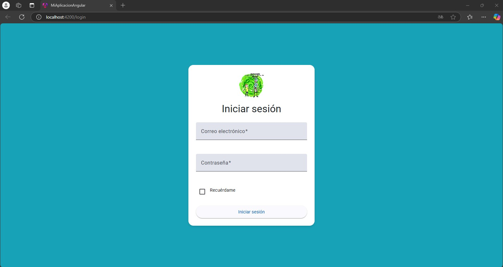

# Integracion de una API con Angular
Este proyecto de Angular 18.2 está diseñado para consumir una API de usuarios, una API de Rick and Morty y mostrarlos en una tabla

## Caracteristicas
Validacion del login con la API de Usuarios
Se muestran los usuarios de la Api en una tabla
Consumo de API: Obtención de datos de usuario desde una API
Se consume la API de Rick and Morty
Se muestran los personajes de la serie de Rick and Morty en una tabla

## Link de la Api de Usuarios

#### Get all items

```https:
https//api.escuelajs.co/api/v1/users
```

## Link de la Api de Rick and Morty

#### Get all items

```https:
https://rickandmortyapi.com/api/character
```
## Login


## Dasboard con personajes de la serie de Rick and Morty


## Ejecucion de la aplicacion de manera local

Clona el repositorio

```bash
  https://github.com/Ferchox45/prograwebLFCH-API.git
```

Vamos a la carpeta del proyecto

```bash
  cd prograwebLFCH-API
```

Instalamos dependencias

```bash
  npm install
```

Corremos el servidor de manera local

```bash
  ng serve
```
Abrimos la siguiente ruta en nuestro navegador:

```bash
 http://localhost:4200/
```


## Licencia

